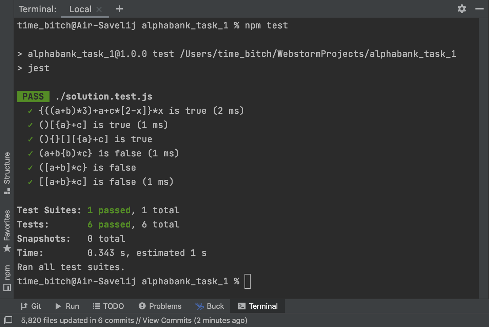

# alphabank_task_1
Первое тестовое задание на стажировку в Альфа-банк

### Для автоматизации тестирования использовал Jest  
Для установки всех зависимостей `npm install`  
Для запуска тестов `npm test`  

### Сложность 
Вычислительная сложность O(n), где n - количество символов в строке.

### Само задание:  
Дано алгебраическое выражение, использующее скобки только трех типов: (), [] {}. 
Необходимо написать функцию, которая получает на вход алгебраическое выражение в виде строки и валидирует расстановку скобок в выражении. 
Функция возвращает true, если все скобки расставлены верно и false, если в расстановке скобок есть ошибка. 
Открывающаяся скобка должна быть закрыта скобкой своего типа. 
Демонстрация нескольких решений будет огромным плюсом.

### Пример работы функции:  
const correct1 = ‘{((a+b)*3) + a + c*[2-x]}*x’;  
const correct2 = ‘()[{a}+c]’;  
const incorrect1 = ‘(a+{b) *c}’;  
const incorrect2 = ‘([a+b]*c}’;  

solution(correct1) === true;   
solution(correct2) === true;   
solution(incorrect1) === false;   
solution(incorrect2) === false;  

### Картинка с пройденными тестами

